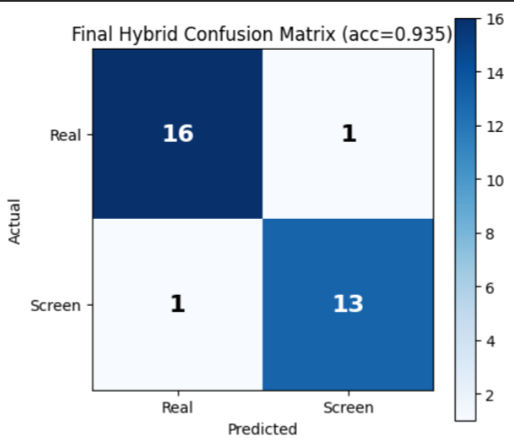
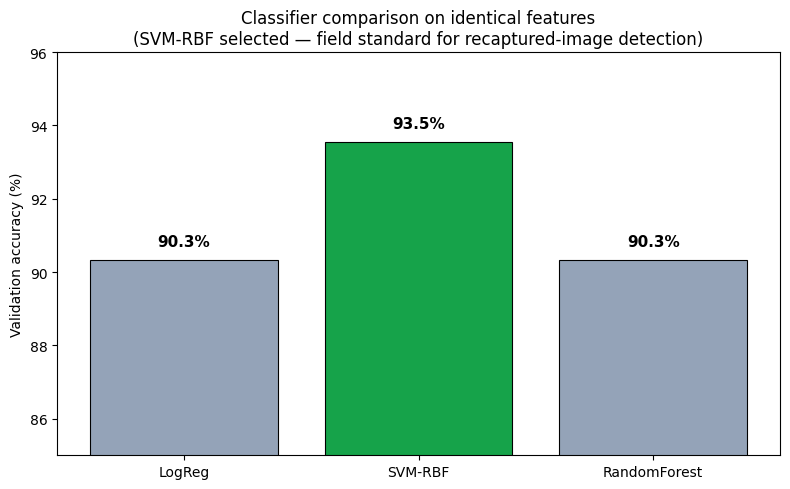
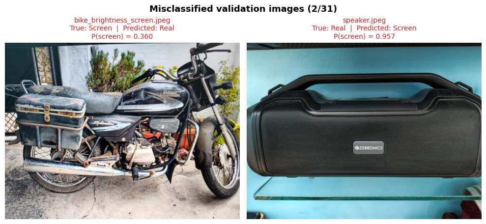

# Real Photo vs. Photo-of-Screen Detection

## Overview

This project detects whether an input image is a **real photograph** or a **photograph of another display (screen recapture)**.

The final solution combines **physics-inspired handcrafted image features** with **EfficientNet-B0 image embeddings**, followed by an **SVM (RBF kernel)** classifier.

---

# Final Validation Performance

**Final model:** Hybrid (Handcrafted Features + EfficientNet-B0 Embeddings → SVM-RBF)

**Held-out validation accuracy:** **93.5%**

This accuracy is measured on my held-out validation split and is reported honestly as the final validation result.

---

# Approach

Rather than treating this purely as an object recognition problem, I approached it as an **image formation** problem.

A photographed screen introduces subtle physical artifacts that are usually absent from genuine photographs, including:

- periodic LCD pixel-grid structure
- moiré interference
- harmonic frequency patterns
- slight blur and glare
- chromatic edge artifacts

To capture these effects, I first designed a classical computer vision pipeline using handcrafted frequency-domain features. I then evaluated multiple pretrained vision models and finally combined the complementary strengths of handcrafted features and EfficientNet-B0 embeddings.

The final feature vector consists of:

- Handcrafted frequency-domain and image-quality features
- EfficientNet-B0 image embeddings (reduced using PCA)
- Final classification using an SVM with an RBF kernel

---

# Experiments

I evaluated several approaches on the same held-out validation set.

| Approach | Validation Accuracy |
|-----------|--------------------:|
| Handcrafted Features + Random Forest | 87.5% |
| MobileNetV3 (Frozen) | 83.3% |
| ConvNeXt-Tiny (Frozen) | 83.3% |
| CLIP ViT-B/32 + Logistic Regression | 79.2% |
| EfficientNet-B0 (Frozen) | 83.9% |
| Hybrid (Handcrafted + EfficientNet) + Logistic Regression | 90.3% |
| **Hybrid + SVM (RBF) — Final** | **93.5%** |

The final hybrid model consistently outperformed both the handcrafted-only and CNN-only approaches.

The handcrafted features explicitly capture physical screen artifacts, while EfficientNet embeddings provide complementary texture and appearance information.

Among the classifiers evaluated, the non-linear SVM (RBF kernel) achieved the best validation performance and was therefore selected for the final model.

## Confusion Matrix

Validation set confusion matrix for the final hybrid model (29/31 correct). The two errors are one screen image predicted as real and one real image predicted as screen — a balanced error profile with no systematic bias toward either class.
---

# Classifier Comparison

*Comparison of the evaluated approaches on the held-out validation set.*

---

# Failure Analysis

The final model misclassified only two validation images.

These represent the primary remaining failure modes:

- A photographed screen displaying realistic content with almost no visible display artifacts.
- A glossy real object whose reflections resemble screen glare.

These cases are genuinely challenging because the physical cues distinguishing real photos from screen recaptures become extremely weak.

*Examples of the remaining validation errors.*

---
## Dataset

The dataset consists of real photographs and photographs of screens, split into training and validation sets:

| Split      | Real | Screen | Total |
| ---------- | ---: | -----: | ----: |
| Training   |   60 |     49 |   109 |
| Validation |   17 |     14 |    31 |
| **Total**  |  **77** | **63** | **140** |

The validation set was held out throughout — it was never used during feature selection, model training, or hyperparameter tuning. All reported accuracy figures are measured on this held-out validation split.

The dataset images are not included in this repository; the trained model (`hybrid_screen_classifier.pkl`) is provided directly for inference.

# Latency

**Device:** Laptop CPU (no GPU)

Latency was measured using warm runs with model loading excluded.

| Metric | Value |
|---------|-------|
| Average inference time | ~2.0–3.5 seconds per image |

Runtime is dominated by handcrafted FFT-based feature extraction. To bound worst-case runtime on very high-resolution images, the input resolution is capped at approximately **2200 pixels** on the longer side.

Although this is slower than a pure CNN solution, the additional handcrafted features significantly improved validation accuracy.

---

# Cost per Image

### On-device

The model runs entirely offline using PyTorch, OpenCV and scikit-learn.

**Estimated cost:** **~$0 per image**

---

### Cloud Deployment

Assuming a low-cost CPU instance (~$0.04/hour) processing approximately 1,200 images/hour:

- **≈ $0.03 per 1,000 images**
- **≈ $30 per million images**

No GPU or external API is required.

---

# Design Trade-offs

I chose a hybrid model because it achieved the highest validation accuracy among all evaluated approaches.

This improves robustness by combining:

- interpretable physics-inspired handcrafted features
- learned image representations from EfficientNet-B0

The primary trade-off is increased CPU latency due to handcrafted frequency-domain feature extraction.

---

# How I Would Improve It

Given additional development time, I would focus on:

- collecting a significantly larger and more diverse training dataset
- adding more difficult screen images containing realistic photographic content
- optimizing or replacing the FFT feature extraction stage for lower CPU latency
- investigating lightweight residual/noise representations to further improve robustness

The experiments suggest that increased dataset diversity would likely provide the largest improvement in generalization.

---

# Deployment Considerations

## Adapting to New Cheating Strategies

As new devices and cheating patterns appear, I would continuously collect difficult false positives and false negatives from production, label them, and periodically retrain the model.

This continual learning approach would allow the detector to adapt without redesigning the pipeline.

---

## Mobile Deployment

For deployment on mobile devices, I would:

- replace or heavily optimize the handcrafted FFT pipeline
- quantize the EfficientNet backbone
- distill the hybrid model into a smaller student network

These changes would substantially reduce latency while preserving most of the current accuracy.

---

## Choosing the Decision Threshold

The model outputs a probability rather than a hard decision.

The operating threshold should be selected using a validation set according to the application's requirements.

For example:

- higher recall if missing fraudulent submissions is more costly
- higher precision if minimizing false alarms is more important

This allows the same model to be adapted to different deployment scenarios without retraining.

---

# Conclusion

I systematically evaluated both classical computer vision and modern pretrained vision models before selecting the final approach.

The final hybrid model combines handcrafted image features with EfficientNet-B0 embeddings and an SVM classifier, achieving the strongest validation performance (**93.5%**) while remaining fully offline and deployable on commodity CPU hardware.

The remaining failure cases primarily occur when the distinguishing physical artifacts of a photographed screen are largely absent, indicating the need for more diverse training data and additional real-world examples.
